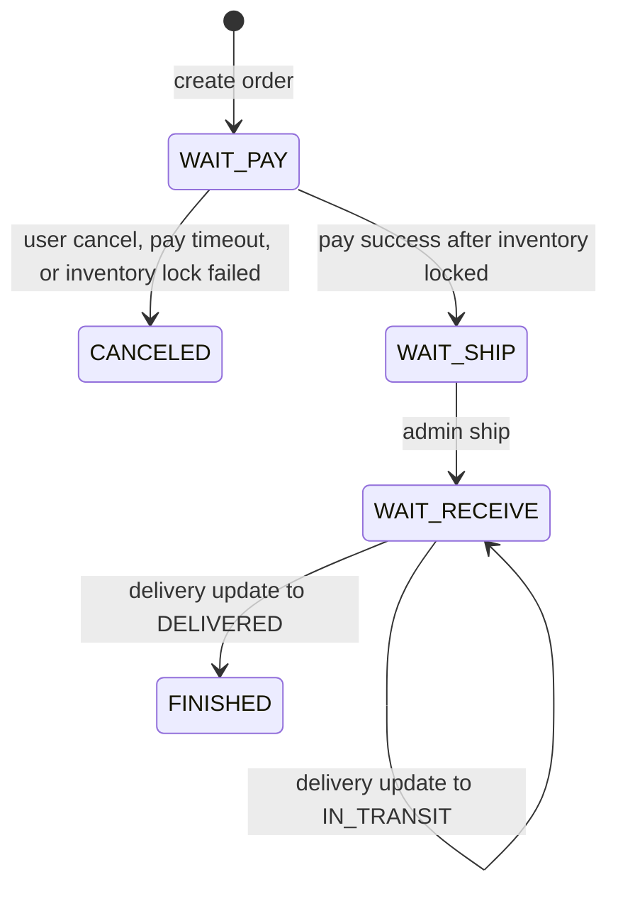

# Order state machine

The order aggregate stores five status dimensions:

| Field | Current values |
| --- | --- |
| `orderStatus` | `WAIT_PAY`, `WAIT_SHIP`, `WAIT_RECEIVE`, `FINISHED`, `CANCELED` |
| `payStatus` | `UNPAID`, `PAID`, `CLOSED`, `REFUNDED` |
| `deliveryStatus` | `UNSHIPPED`, `SHIPPED`, `IN_TRANSIT`, `DELIVERED` |
| `aftersaleStatus` | `NONE`, `APPLYING`, `REJECTED`, `REFUNDED` |
| `inventoryStatus` | `LOCK_PENDING`, `LOCKED`, `LOCK_FAILED`, `RELEASE_PENDING`, `RELEASED` |

Next-state refinements should stay in these non-primary dimensions: add `PARTIAL_REFUNDED` to `payStatus`, and add review/refund progress states such as `APPROVED`, `REFUNDING`, and `PARTIAL_REFUNDED` to `aftersaleStatus`.

## Primary flow

Refunds and returns are modeled as payment/aftersale state, not as a main order flow state. For example, a delivered order can stay `orderStatus=FINISHED` while `payStatus=REFUNDED` and `aftersaleStatus=REFUNDED` after a full aftersale refund.

## Transition table

| Transition | Preconditions | Side effects |
| --- | --- | --- |
| create order | cart and settlement data valid | `orderStatus=WAIT_PAY`, `payStatus=UNPAID`, `deliveryStatus=UNSHIPPED`, `aftersaleStatus=NONE`, `inventoryStatus=LOCK_PENDING`; inventory lock event outbox row created |
| inventory locked | `WAIT_PAY`, `UNPAID`, and `LOCK_PENDING` | `inventoryStatus=LOCKED`; order remains payable |
| inventory lock failed | `WAIT_PAY`, `UNPAID`, and `LOCK_PENDING` | `orderStatus=CANCELED`, `payStatus=CLOSED`, `inventoryStatus=LOCK_FAILED`, `cancelTime` set, cancel reason set to stock shortage; release locked coupon and reserved points |
| cancel unpaid order | `WAIT_PAY`, `UNPAID`, and inventory is not `LOCK_FAILED` | `orderStatus=CANCELED`, `payStatus=CLOSED`, `cancelTime` set, `inventoryStatus=RELEASE_PENDING` when stock had been locked or lock may still arrive; inventory cancel event outbox row created |
| inventory released | `RELEASE_PENDING` | `inventoryStatus=RELEASED` |
| pay order | `WAIT_PAY`, `UNPAID`, `inventoryStatus=LOCKED`, and before expiry | `orderStatus=WAIT_SHIP`, `payStatus=PAID`, `deliveryStatus=UNSHIPPED`, `payTime` set |
| pay expired order | `WAIT_PAY` and `UNPAID` after expiry | `orderStatus=CANCELED`, `payStatus=CLOSED`, `cancelTime` set, `inventoryStatus=RELEASE_PENDING` when needed; inventory cancel event outbox row created |
| ship order | `WAIT_SHIP` and `PAID` | `orderStatus=WAIT_RECEIVE`, `deliveryStatus=SHIPPED`, logistics fields and `deliveryTime` set |
| update delivery | shipped order with delivery time | `deliveryStatus=SHIPPED`, `IN_TRANSIT`, or `DELIVERED`; `DELIVERED` also sets `orderStatus=FINISHED` and `finishTime` |
| request aftersale | paid order, aftersale status is `NONE` or `REJECTED` | `aftersaleStatus=APPLYING` |
| reject aftersale | `aftersaleStatus=APPLYING` | `aftersaleStatus=REJECTED` |
| approve refund before shipment | `aftersaleStatus=APPLYING`, `payStatus=PAID`, and `deliveryStatus=UNSHIPPED` | `orderStatus` is unchanged; `payStatus=REFUNDED`, `aftersaleStatus=REFUNDED`, `inventoryStatus=RELEASE_PENDING` when refundable locked stock exists; `REFUND_APPROVED` releases `lockedStock` back to `availableStock` |
| approve refund after shipment, refund only | `aftersaleStatus=APPLYING`, `payStatus=PAID`, and order has shipped | `orderStatus` is unchanged; `payStatus=REFUNDED`, `aftersaleStatus=REFUNDED`; do not increase `availableStock` because goods are not returned |
| approve return/refund after shipment | `aftersaleStatus=APPLYING`, `payStatus=PAID`, order has shipped, and returned goods have been received or inspected | `orderStatus` is unchanged; `payStatus=REFUNDED`, `aftersaleStatus=REFUNDED`; inventory is restored only after return receipt/inspection, either to `availableStock` if saleable or to `returnedStock` if not directly saleable |

## Invariants

- `CANCELED` and `FINISHED` are terminal for the main order flow.
- `REFUNDED` and `PARTIAL_REFUNDED` belong to the payment and aftersale dimensions; they do not imply changing `orderStatus`.
- A paid order cannot be cancelled through the unpaid cancel path.
- A pending payment order is payable only after `inventoryStatus=LOCKED`.
- `LOCK_FAILED` closes an unpaid order automatically and releases coupon/point reservations.
- A late payment callback must not move a `CANCELED` or `LOCK_FAILED` order to `WAIT_SHIP`; it should enter payment reversal or refund handling.
- Delivery cannot be updated until the order has been shipped.
- Refund approval is idempotent when `aftersaleStatus=REFUNDED`.
- `REFUND_APPROVED` only means inventory release for pre-shipment refunds in the current implementation; post-shipment refund-only cases must not restore saleable stock.
- Returned goods restore stock only after receipt/inspection, not at refund approval time.
- Inventory events are published from outbox tables and are safe to retry.

## Review checklist for future changes

1. Add or update integration tests for every new transition.
2. Confirm side effects are transactional with the order state change.
3. Confirm outbox events remain idempotent and replay safe.
4. Update this document before exposing a new status to the frontend or admin UI.
