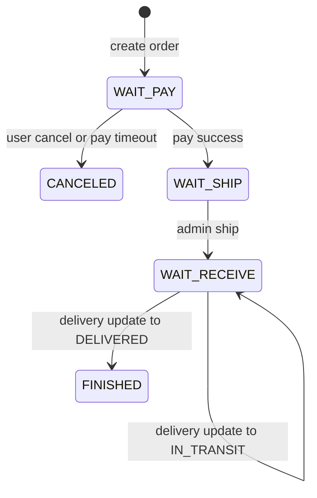

# Order state machine

The order aggregate stores four status dimensions:

| Field | Current values |
| --- | --- |
| `orderStatus` | `WAIT_PAY`, `WAIT_SHIP`, `WAIT_RECEIVE`, `FINISHED`, `CANCELED` |
| `payStatus` | `UNPAID`, `PAID`, `CLOSED`, `REFUNDED` |
| `deliveryStatus` | `UNSHIPPED`, `SHIPPED`, `IN_TRANSIT`, `DELIVERED` |
| `aftersaleStatus` | `NONE`, `APPLYING`, `REJECTED`, `REFUNDED` |

Next-state refinements should stay in these non-primary dimensions: add `PARTIAL_REFUNDED` to `payStatus`, and add review/refund progress states such as `APPROVED`, `REFUNDING`, and `PARTIAL_REFUNDED` to `aftersaleStatus`.

## Primary flow

Refunds and returns are modeled as payment/aftersale state, not as a main order flow state. For example, a delivered order can stay `orderStatus=FINISHED` while `payStatus=REFUNDED` and `aftersaleStatus=REFUNDED` after a full aftersale refund.

## Transition table

| Transition | Preconditions | Side effects |
| --- | --- | --- |
| create order | cart and settlement data valid | `orderStatus=WAIT_PAY`, `payStatus=UNPAID`, `deliveryStatus=UNSHIPPED`, `aftersaleStatus=NONE`; inventory lock event outbox row created |
| cancel unpaid order | `WAIT_PAY` and `UNPAID` | `orderStatus=CANCELED`, `payStatus=CLOSED`, `cancelTime` set; inventory cancel event outbox row created |
| pay order | `WAIT_PAY` and `UNPAID` before expiry | `orderStatus=WAIT_SHIP`, `payStatus=PAID`, `deliveryStatus=UNSHIPPED`, `payTime` set |
| pay expired order | `WAIT_PAY` and `UNPAID` after expiry | `orderStatus=CANCELED`, `payStatus=CLOSED`, `cancelTime` set; inventory cancel event outbox row created |
| ship order | `WAIT_SHIP` and `PAID` | `orderStatus=WAIT_RECEIVE`, `deliveryStatus=SHIPPED`, logistics fields and `deliveryTime` set |
| update delivery | shipped order with delivery time | `deliveryStatus=SHIPPED`, `IN_TRANSIT`, or `DELIVERED`; `DELIVERED` also sets `orderStatus=FINISHED` and `finishTime` |
| request aftersale | paid order, aftersale status is `NONE` or `REJECTED` | `aftersaleStatus=APPLYING` |
| reject aftersale | `aftersaleStatus=APPLYING` | `aftersaleStatus=REJECTED` |
| approve refund | `aftersaleStatus=APPLYING` | `orderStatus` is unchanged; `payStatus=REFUNDED`, `aftersaleStatus=REFUNDED`; refund event drives inventory release |

## Invariants

- `CANCELED` and `FINISHED` are terminal for the main order flow.
- `REFUNDED` and `PARTIAL_REFUNDED` belong to the payment and aftersale dimensions; they do not imply changing `orderStatus`.
- A paid order cannot be cancelled through the unpaid cancel path.
- Delivery cannot be updated until the order has been shipped.
- Refund approval is idempotent when `aftersaleStatus=REFUNDED`.
- Inventory events are published from outbox tables and are safe to retry.

## Review checklist for future changes

1. Add or update integration tests for every new transition.
2. Confirm side effects are transactional with the order state change.
3. Confirm outbox events remain idempotent and replay safe.
4. Update this document before exposing a new status to the frontend or admin UI.
